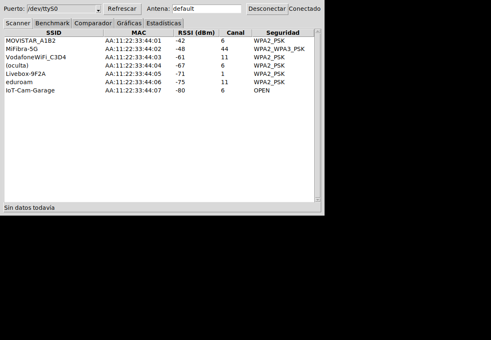
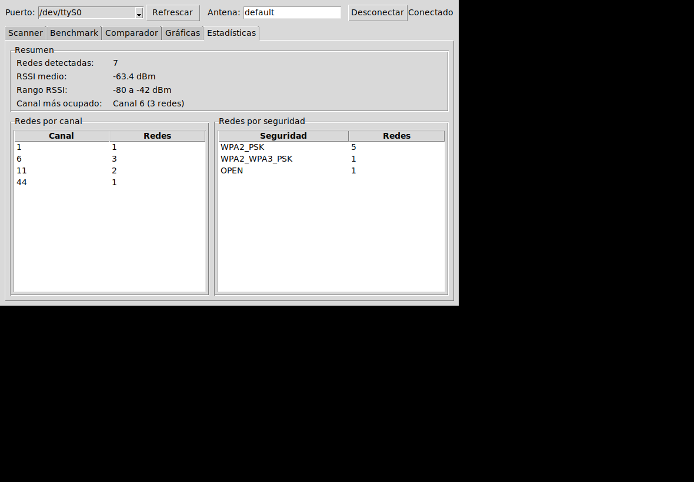
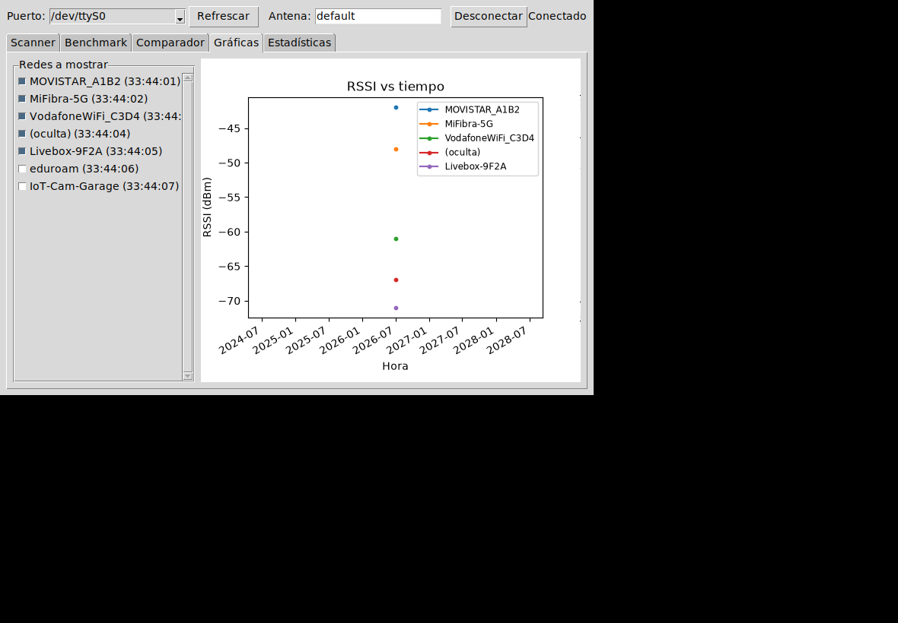
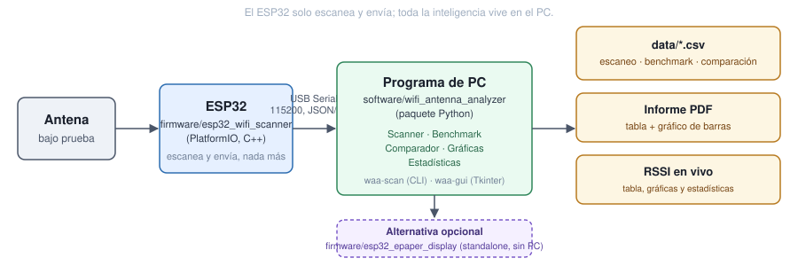

<div align="center">

# ESP32 Wi-Fi Antenna Analyzer

**Compara antenas Wi-Fi de forma objetiva y repetible, con un ESP32 como sensor RSSI.**

[](https://github.com/AlvGJ-UGR/esp32-wifi-antenna-analyzer/actions/workflows/ci.yml)
[](software/pyproject.toml)
[](firmware/esp32_wifi_scanner)
[](LICENSE)

[Instalación](#instalación-rápida) ·
[Uso](#uso) ·
[Hardware](#hardware-necesario) ·
[Arquitectura](#arquitectura) ·
[Estado del proyecto](#estado-del-proyecto)

</div>

---

¿Cuánto mejor es realmente esa antena nueva que te acabas de comprar?
**ESP32 Wi-Fi Antenna Analyzer** convierte un ESP32 en un instrumento
de medida: escanea las redes Wi-Fi alrededor, mide su RSSI de forma
repetible, y deja comparar dos antenas cara a cara con números
concretos en vez de "a mí me parece que esta pilla mejor" — cuántas
redes detecta cada una, qué RSSI medio consigue, en qué canales
rinde mejor, con cuánta variabilidad.

<p align="center">
  
</p>

<p align="center"><em>Comparador de antenas: cada red emparejada por dirección MAC entre dos benchmarks, con la diferencia de RSSI en dB.</em></p>

## Índice

- [Características](#características)
- [Capturas](#capturas)
- [Hardware necesario](#hardware-necesario)
- [Arquitectura](#arquitectura)
- [Instalación rápida](#instalación-rápida)
- [Uso](#uso)
- [Estructura del repositorio](#estructura-del-repositorio)
- [Desarrollo y tests](#desarrollo-y-tests)
- [Estado del proyecto](#estado-del-proyecto)
- [Licencia](#licencia)

## Características

- **Scanner en tiempo real** — tabla de redes visibles con RSSI, canal y seguridad, actualizada en vivo.
- **Modo Benchmark** — ventana de medición configurable; RSSI medio, desviación típica, mínimo y máximo por red, agrupado por dirección MAC.
- **Comparador de antenas** — empareja dos benchmarks por MAC (no por nombre de red) y calcula la diferencia de RSSI en dB, red a red.
- **Gráficas y Estadísticas en vivo** — RSSI vs tiempo por red, canal más ocupado, desglose por tipo de seguridad.
- **Export a CSV y PDF** — cada benchmark y cada comparación se guardan solos; informe PDF de una página listo para adjuntar a una memoria.
- **Modo standalone con pantalla e-paper** *(opcional)* — firmware alternativo para medir sin portátil, con una Waveshare 2.13" e-Paper HAT.
- **CLI y GUI** — `waa-scan` para un logger de consola simple, `waa-gui` para la experiencia completa.

## Capturas

<table>
<tr>
<td width="50%">

<p align="center"><sub>Scanner en vivo</sub></p>
</td>
<td width="50%">

<p align="center"><sub>Benchmark (media, desviación, mín/máx por red)</sub></p>
</td>
</tr>
<tr>
<td width="50%">

<p align="center"><sub>Estadísticas en vivo</sub></p>
</td>
<td width="50%">

<p align="center"><sub>RSSI vs tiempo</sub></p>
</td>
</tr>
</table>

<sub>Capturas generadas con datos sintéticos (`software/scripts/generate_screenshots.py`) ejecutando la GUI real sobre Xvfb — no son mockups.</sub>

## Hardware necesario

| Componente | Notas |
|---|---|
| **ESP32** | Desarrollado sobre ESP32-WROOM-32UE (conector U.FL/IPEX externo). Cualquier ESP32 con Wi-Fi debería valer — ver [notas de antena](firmware/esp32_wifi_scanner/README.md#notas-de-hardware--esp32-wroom-32ue) si tu módulo es distinto. |
| **Antena(s) a comparar** | Compatibles con el conector de tu módulo (U.FL/MHF-I/AMC son el mismo conector, distinto nombre comercial). El WROOM-32UE se vende **sin antena** — hace falta conectar una. |
| **Cable USB** | Para flashear el firmware y, si usas `waa-scan`/`waa-gui`, para la transmisión de datos en vivo (115200 baudios). |
| **Pantalla e-paper** *(opcional)* | Waveshare 2.13" e-Paper HAT, para el [modo standalone](#modo-standalone-con-pantalla-e-paper-opcional) sin PC. |

## Arquitectura

<p align="center">
   ESP32 -> USB Serial JSON -> programa de PC -> CSV/PDF/GUI">
</p>

El ESP32 solo escanea y manda datos por Serial; toda la inteligencia
(guardado, estadísticas, comparación, gráficas) vive en el PC. Esa
separación es deliberada: mantiene el firmware simple y testeable, y
permite iterar la lógica de análisis sin volver a flashear la placa.

## Instalación rápida

```bash
# 1. Software de PC
cd software
python -m venv .venv
source .venv/bin/activate        # Windows: .venv\Scripts\activate
pip install -e ".[dev]"

# 2. Firmware del ESP32 (requiere PlatformIO: pip install platformio)
cd ../firmware/esp32_wifi_scanner
pio run --target upload
pio device monitor
```

El paso 1 instala el paquete y dos comandos:

- `waa-scan --port COM5 --antenna dipolo_5dbi` — lector de consola, guarda en `data/*.csv`.
- `waa-gui` — interfaz gráfica completa: Scanner, Benchmark, Comparador, Gráficas y Estadísticas.

Detalles del firmware y alternativa con Arduino IDE en
[`firmware/esp32_wifi_scanner/README.md`](firmware/esp32_wifi_scanner/README.md).

## Uso

### Modo Benchmark

Desde la pestaña **Benchmark** de `waa-gui`:

1. Conéctate al ESP32 desde la barra superior e indica el nombre de
   la antena que estás probando.
2. Indica la duración (segundos) y pulsa **Iniciar Benchmark**.
3. Durante la ventana se acumulan las muestras de RSSI de cada red
   agrupadas por BSSID (no por SSID, para no confundir redes con el
   mismo nombre). Al terminar se muestra una tabla con muestras,
   RSSI medio, desviación típica, mínimo y máximo por red, ordenada
   de mejor a peor señal.
4. El resumen se guarda automáticamente en
   `data/benchmark_<antena>_<timestamp>.csv`.

Cada benchmark completado queda también en memoria durante la sesión
de `waa-gui`, listo para usarse en el Comparador sin repetir la
medición.

### Comparador de antenas

Desde la pestaña **Comparador**:

1. Corre un benchmark con la antena A (p.ej. nombrándola `dipolo` en
   la barra de conexión) y otro con la antena B (p.ej. `yagi`) —
   pueden ser la misma sesión de `waa-gui`, sin reiniciar el
   programa; cada benchmark completado queda guardado en memoria
   bajo el nombre de antena usado.
2. Selecciona ambas antenas en los desplegables y pulsa **Comparar**.
3. La tabla empareja las redes por BSSID (no por SSID) y muestra el
   RSSI medio de cada antena y la diferencia en dB. Las redes que
   solo detectó una de las dos antenas aparecen como "no detectada"
   en la otra columna, en vez de mezclarse con otra red del mismo
   nombre.
4. El resultado se guarda automáticamente en
   `data/comparison_<A>_vs_<B>_<timestamp>.csv`.

### Gráficas y Estadísticas

Mientras estás conectado, dos pestañas más se refrescan solas cada
segundo con lo que va llegando:

- **Estadísticas**: nº de redes visibles, RSSI medio/mín/máx, canal
  más ocupado, y desglose por canal y por tipo de seguridad.
- **Gráficas**: RSSI vs tiempo, una línea por red. Por defecto se
  muestran las 5 redes con mejor señal (se puede activar/desactivar
  cualquiera desde la lista de checkboxes) para que el gráfico no se
  sature si hay muchas redes alrededor.

### Informe PDF

Desde la pestaña **Benchmark**, el botón **Exportar PDF** (activo
tras completar un benchmark) genera un informe de una página con la
tabla de resultados y un gráfico de barras de RSSI medio ±
desviación típica por red — útil para adjuntar a una memoria o
comparar visualmente antenas sin abrir la GUI.

### Modo standalone con pantalla e-paper (opcional)

Si tienes una pantalla Waveshare 2.13" e-Paper HAT, hay un firmware
alternativo en
[`firmware/esp32_epaper_display/`](firmware/esp32_epaper_display/)
que muestra las redes con mejor señal directamente en la pantalla,
sin necesitar el portátil conectado — útil para medir andando por un
edificio con solo ESP32 + pantalla + batería. Es un proyecto
PlatformIO independiente del firmware principal (no son
intercambiables, ver el README de esa carpeta para el cableado y
las limitaciones conocidas).

## Estructura del repositorio

```
esp32-wifi-antenna-analyzer/
├── .github/workflows/ci.yml        # tests + lint + build del firmware en cada push
├── firmware/esp32_wifi_scanner/    # proyecto PlatformIO (firmware principal)
│   ├── platformio.ini
│   ├── include/config.h            # constantes (baudrate, intervalo de escaneo...)
│   └── src/main.cpp
├── firmware/esp32_epaper_display/  # proyecto PlatformIO alternativo (opcional, Fase 6):
│   └── ...                         # modo standalone con pantalla Waveshare 2.13"
├── software/                       # paquete Python instalable
│   ├── pyproject.toml
│   ├── scripts/generate_screenshots.py  # regenera docs/screenshots/ desde la GUI real
│   ├── src/wifi_antenna_analyzer/
│   │   ├── models.py             # NetworkSample, ScanEnd, BenchmarkResult, SecurityType
│   │   ├── serial_link.py        # conexión + parseo del protocolo JSON
│   │   ├── benchmark.py          # BenchmarkSession: agrega RSSI por BSSID en una ventana
│   │   ├── comparator.py         # compare_antennas: empareja dos benchmarks por BSSID
│   │   ├── network_stats.py      # estadísticas en vivo + ScanHistory (series RSSI vs tiempo)
│   │   ├── report.py             # export_benchmark_pdf: informe PDF (tabla + gráfico)
│   │   ├── storage.py            # persistencia (CSV; ver "Decisiones" sobre SQLite)
│   │   ├── cli.py                # `waa-scan` — versión de consola
│   │   └── gui/                  # `waa-gui` — interfaz gráfica (Tkinter)
│   │       ├── app.py            #   ventana principal + orquestación
│   │       ├── benchmark_tab.py  #   pestaña "Benchmark" (+ botón exportar PDF)
│   │       ├── comparator_tab.py #   pestaña "Comparador"
│   │       ├── charts_tab.py     #   pestaña "Gráficas" (RSSI vs tiempo, matplotlib)
│   │       └── statistics_tab.py #   pestaña "Estadísticas"
│   └── tests/                    # pytest, sin necesidad de hardware
├── docs/PLAN.md                    # plan de desarrollo por fases
├── docs/screenshots/                # capturas y diagramas usados en este README
├── data/                            # CSVs/PDFs generados (ignorados por git salvo .gitkeep)
├── CONTRIBUTING.md
├── CHANGELOG.md
└── LICENSE                          # MIT
```

## Desarrollo y tests

Ver [CONTRIBUTING.md](CONTRIBUTING.md). En resumen:

```bash
cd software && pytest && ruff check . && black --check .
cd firmware/esp32_wifi_scanner && pio run
cd firmware/esp32_epaper_display && pio run  # opcional, solo si tocas ese firmware
```

Todo esto se ejecuta automáticamente en CI en cada push/PR (el
firmware e-paper en un job aparte que no bloquea el resto si falla —
es una funcionalidad opcional, no el firmware principal).

## Estado del proyecto

Ver [docs/PLAN.md](docs/PLAN.md) para el detalle completo y
[CHANGELOG.md](CHANGELOG.md) para el historial de cambios por versión.

- [x] Fase 1 — Firmware ESP32 (escaneo + JSON por USB), como proyecto PlatformIO
- [x] Fase 1.5 — Paquete Python con capa serial/storage testeada (`waa-scan`)
- [x] Fase 2 — GUI en tiempo real, pestaña Scanner (`waa-gui`)
- [x] Fase 3 — Modo Benchmark (duración configurable, media/desv/máx/mín por red, export CSV)
- [x] Fase 4 — Comparador de antenas por BSSID
- [x] Fase 5 — Gráficas (RSSI vs tiempo), Estadísticas en vivo, export a PDF
- [ ] Fase 5.1 — historial persistente entre sesiones (SQLite; aplazado, ver `docs/PLAN.md`)
- [x] Fase 6 (parcial) — Modo standalone con pantalla e-paper (Waveshare 2.13")
- [ ] Fase 6 (resto, opcional) — Modo promiscuo, análisis por canal, heatmap GPS, modo radar

## Licencia

MIT — ver [LICENSE](LICENSE).
